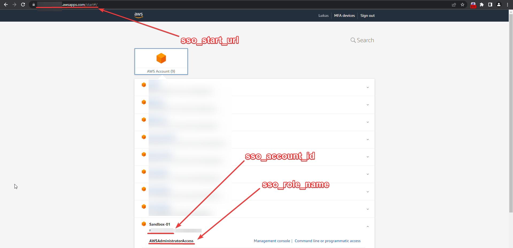
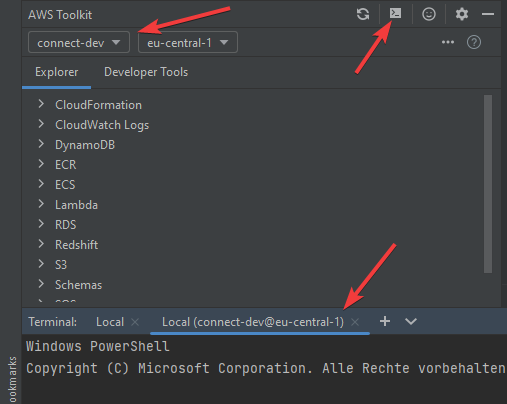

# References
- [AWS Docs - Toolkit for JetBrains - Setup Credentials](https://docs.aws.amazon.com/toolkit-for-jetbrains/latest/userguide/setup-credentials.html)

# Toolkit for JetBrains with AWS SSO
Add the following snippet to your config file `C:\Users\<your windows user name>/.aws/config`:
```
[default]
sso_start_url = https://my-sso-portal.awsapps.com/start
sso_region = us-east-1
sso_account_id = 123456789011
sso_role_name = readOnly
region = us-west-2
```

Change the credentials to fit your account/role-combination:


After configuring the profiles, you can select your account and open a terminal associated with this account. (this won't work if you are using the a WSL terminal like the Ubuntu one instead of Windows PowerShell - [more information](guide-wsl-cloud-dev-environment.md))


You can check whether you are logged into the right account by using the `aws sts get-caller-identity` command.