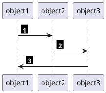

# References
- [PlantUML GitHub](https://github.com/plantuml/plantuml)
- [AWS Icons for Plant UML GitHub](https://github.com/awslabs/aws-icons-for-plantuml)

# Auto numbering
## Challenge
Whenever you add numbering to a diagram (for referencing or for outlining a sequence) you have to number each object like an arrow manually. If you then add another object in between two existing ones, you will have to increment all the following numbers by one.
So naturally one would want to prevent this and add a way to assign numbers to each object, which will automatically adjust as soon as you add another object or change their order.

## Solution
In order to automatically number arrows (or other objects) add a counter-variable and a function which increases the counter and then returns its value.
```
!$counter = 0
!function $count()
!$counter = $counter + 1
!return $counter
!endfunction
```

A second function just calls the first function and adds some styling to the number.
```
!procedure $stepnum()
<back:black><color:white><b> $count() </b></color></back>
!endprocedure
```

When defining the arrows, add the numbers by calling `stepnum()`:
```
object1 -> object2 : $stepnum()
object2 -> object3 : $stepnum()
object3 -> object1 : $stepnum()
```

## Example:


# Tags
#markdown #notekeeping #creating-documentation